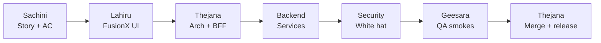
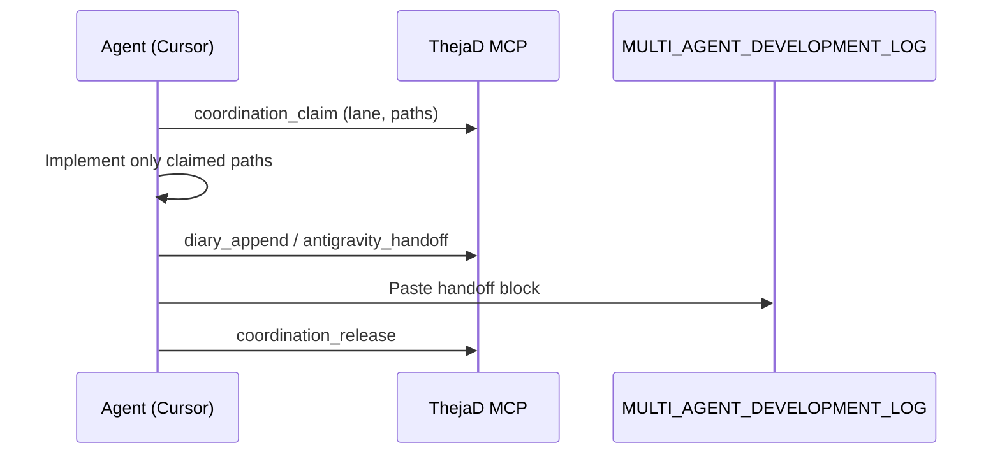

<p align="center">
  <strong>ThejaD MCP</strong><br/>
  <em>LOLC Internet Banking — AI engineering platform for Cursor, Claude Code, Antigravity & Copilot</em>
</p>

<p align="center">
  <a href="https://github.com/thejanaloit/ThejaD.git"><strong>github.com/thejanaloit/ThejaD</strong></a> ·
  <code>1000+ tools</code> ·
  <code>85+ prompts</code> ·
  <code>60+ agent patterns</code> ·
  <code>14k device index</code>
</p>

---

## Table of contents

1. [What is ThejaD?](#what-is-thejad)
2. [At a glance](#at-a-glance)
3. [Engineering team](#engineering-team)
4. [Delivery workflow](#delivery-workflow)
5. [Install](#install)
6. [Multi-MCP setup](#multi-mcp-setup)
7. [Powered capabilities](#powered-capabilities)
8. [60+ AI orchestration](#60-ai-orchestration)
9. [Memory](#memory)
10. [Multi-user development (no collisions)](#multi-user-development-no-collisions)
11. [Token usage reduction](#token-usage-reduction)
12. [Offline models (Ollama)](#offline-models-ollama)
13. [Full device index](#full-device-index)
14. [Capability modes](#capability-modes)
15. [MCP tools reference](#mcp-tools-reference)
16. [Prompts & resources](#prompts--resources)
17. [FusionX & Phase 1 scope](#fusionx--phase-1-scope)
18. [Security](#security)
19. [Repository layout](#repository-layout)
20. [CLI commands](#cli-commands)
21. [Owner inputs](#owner-inputs)

---

## What is ThejaD?

**ThejaD** is a Model Context Protocol (MCP) server built for the **LOLC Internet Banking / FusionX** programme. It unifies:

- A **virtual engineering team** (Thejana, Lahiru, Geesara, Sachini, Security, Backend)
- **1000+ MCP tools** (core banking, swarm/Ruflo-class, Graphify, device scan, coordination)
- **Branded capabilities** — Superpowers ThejaD, Graphify ThejaD, Claude-mem ThejaD, Ruflo ThejaD, and more (all integrated, not listed as external repos)
- **Non-colliding multi-agent** workflows (Cursor + Antigravity + Copilot + humans)
- **Token-efficient** patterns (scope guard, Graphify, doc resources, 80% default tier)
- **Offline** drafting via Ollama

Use it beside **Ruflo ThejaD** (272+ swarm tools, parallel MCP) in the same Cursor workspace.

---

## At a glance

| Capability | Scale |
|------------|--------|
| **MCP tools** | 1000+ (289 core catalog + 731 bulk + named tools) |
| **AI orchestrator patterns** | 60+ (swarm, agents, workers, consensus, SPARC/TDD) |
| **Prompts** | 85+ (team, FusionX, vendors, imported skills) |
| **Resources** | 220+ programme docs (`thejad://doc/...`) |
| **Imported vendor skills** | 30 (LOLC-adapted under `skills/imported/`) |
| **Device index** | 14,248 dev files (C: user + E: projects) |
| **Engineering personas** | 6 roles · **50+ years** collective experience (programme framing) |
| **Version** | 4.5.0 · persistent unlock + Cursor auto-orchestra hooks |

Verify after install:

```bash
node thejad/bin/thejad.js stats
```

---

## Engineering team

Each persona maps to **lanes**, **MCP tools**, and **Claude/Cursor plugins**. Consult any role with:

```text
team_consult  →  role: thejana | lahiru | geesara | sachini | security | backend
```

### Thejana — Supreme Developer & Engineering Lead

| | |
|---|---|
| **Experience** | 50+ years (programme framing) |
| **Lanes** | A, B, C, D (all lanes — merge authority) |
| **Focus** | Architecture, full-stack, BFF, final merge, MCP orchestration, multi-agent speed |
| **MCP tools** | `thejana_supreme_plan`, `engineering_team_roster`, `swarm_init`, `coordination_claim`, `coordination_release` |
| **Plugins** | Superpowers ThejaD, Code review ThejaD, Claude-mem ThejaD, Graphify ThejaD, Ruflo ThejaD |
| **Responsibilities** | Own delivery plan; claim/release coordination; run smokes gate before merge; diary + handoff |

---

### Lahiru — UI / UX Engineer (FusionX)

| | |
|---|---|
| **Experience** | 50+ years (programme framing) |
| **Lanes** | **A** — `apps/web`, UI components, design tokens |
| **Focus** | FusionX / Stitch parity, `SCREEN_ROUTE_MAP`, accessibility, i18n, shell nav |
| **MCP tools** | `lahiru_ui_review`, `figma_context`, `team_consult` role=`lahiru` |
| **Plugins** | Frontend design ThejaD, Superpowers ThejaD, Graphify ThejaD |
| **Responsibilities** | Route ↔ PNG ↔ story binding; middleware + `WorkflowEntryGate` alignment |

---

### Geesara — QA Engineer

| | |
|---|---|
| **Experience** | 50+ years (programme framing) |
| **Lanes** | **E** — test gates |
| **Focus** | Smoke scripts, regression, browser E2E, `typecheck:web` |
| **MCP tools** | `geesara_qa_plan`, `geesara_run_smokes` (full unlock), `smoke_hint` |
| **Plugins** | Code review ThejaD, Superpowers ThejaD |
| **Responsibilities** | Phase1 / accounts / payments smokes; block merge on red CI |

**Smoke commands (repo root):**

```bash
npm run local:health:json
npm run smoke:phase1
npm run smoke:accounts
npm run smoke:phase3:payments
npm run typecheck:web
```

---

### Sachini — Business Analyst

| | |
|---|---|
| **Experience** | 50+ years (programme framing) |
| **Lanes** | **E** — stories & traceability |
| **Focus** | LOLCDL stories, acceptance criteria, route/API binding |
| **MCP tools** | `sachini_story_draft`, `story_lookup`, `scope_guard` |
| **Plugins** | Superpowers ThejaD (`/brainstorm`, `/write-plan`) |
| **Responsibilities** | Story before code; traceability in `data/stories-traceability.json` |

---

### Security — White Hat

| | |
|---|---|
| **Experience** | 50+ years (programme framing) |
| **Lanes** | **D** — security-sensitive paths |
| **Focus** | JWT, BFF cookies, OWASP, dev vs prod flags, PR review |
| **MCP tools** | `security_white_hat_scan`, `scope_guard`, `limits_check` |
| **Plugins** | Security review ThejaD, Code review ThejaD |
| **Responsibilities** | `/lolc-security-review`; GitHub Action `lolc-security-review.yml` |

---

### Backend — NestJS / Kong / Database

| | |
|---|---|
| **Experience** | 50+ years (programme framing) |
| **Lanes** | **C**, **D** — `services/*`, Kong, migrations |
| **Focus** | Nest modules, OpenAPI, bank-adapter, Kafka (where enabled) |
| **MCP tools** | `full_stack_map`, `smoke_hint` |
| **Plugins** | Code review ThejaD, Superpowers ThejaD, Graphify ThejaD |
| **Responsibilities** | Service + migration; never break BFF contract without Lahiru/Thejana |

---

## Delivery workflow



| Step | Who | Action |
|------|-----|--------|
| 1 | Sachini | Story + AC + traceability |
| 2 | Lahiru | UI / FusionX + frontend-design |
| 3 | Thejana | Architecture + BFF + coordination claim |
| 4 | Backend | Nest services + Kong |
| 5 | Security | White-hat + security-review |
| 6 | Geesara | Smokes + regression |
| 7 | Thejana | `coordination_release` + handoff log |

---

## Orchestra workflow (install → login → every prompt)

```mermaid
flowchart LR
  A[thejad init] --> B[thejad_setup_status]
  B --> C[User APIs + logins]
  C --> D[thejad_setup_complete]
  D --> E[User prompt]
  E --> F[thejad_orchestrate]
  F --> G[Models offline + online]
  G --> H[Role + skills + agent]
  H --> I[Token-optimized prompt]
  I --> J[LOLC workflow steps]
```



| Step | MCP tool | What happens |
|------|----------|----------------|
| 1 | `thejad init` | Adds ThejaD to `.cursor/mcp.json` |
| 2 | `thejad_setup_status` | Lists Ollama, repo, optional OpenAI / NotebookLM / Figma — **secrets stay in env only** |
| 3 | User | `ollama pull llama3.2`, `THEJAD_REPO_ROOT`, optional keys, `notebooklm login` |
| 4 | `thejad_setup_complete` | Marks setup done |
| 5 | **Every task** | `thejad_orchestrate` with `prompt: "<user message>"` |
| 6 | Host agent | Runs `optimizedPrompt`, assigned role, skills, agent, online + offline models |

Use MCP prompt **`thejad_orchestra_master`** in Cursor so every chat follows this path.

### Auto-orchestra (no host MCP call)

`.cursor/hooks.json` (installed by `thejad init`) runs on **every user message**:

- **`beforeSubmitPrompt`** → full orchestra → writes **`.thejad/last-orchestra.md`**
- **`sessionStart`** → tier, setup state, mandate to read last-orchestra file

The agent follows the hook output; you do not need to call `thejad_orchestrate` manually.

---

## Install

### Prerequisites

- **Node.js 20+**
- **Git**
- Internet Banking monorepo (or clone [ThejaD](https://github.com/thejanaloit/ThejaD.git) into your project)

### Step 1 — One-shot setup (recommended)

From monorepo root (`e:\internetBanking`):

```powershell
powershell -ExecutionPolicy Bypass -File thejad/install/install-engineering-plugins.ps1
```

This will:

1. Clone all vendor repos into `thejad/vendor/`
2. Import **30** vendor skills → `thejad/skills/imported/`
3. Copy team skills → `.cursor/skills/`
4. Add `.claude/commands/lolc-security-review.md`
5. Rebuild **full device index** (14k+ files)

### Step 2 — Cursor MCP

**Option A** — init helper:

```bash
node thejad/bin/thejad.js init
```

**Option B** — merge into `.cursor/mcp.json`:

```json
{
  "mcpServers": {
    "ThejaD": {
      "command": "node",
      "args": ["thejad/bin/thejad.js", "mcp", "start"],
      "env": {
        "THEJAD_REPO_ROOT": "e:/internetBanking",
        "npm_config_update_notifier": "false"
      }
    }
  }
}
```

> Use **direct** `node thejad/bin/thejad.js` — do not wrap with a script that uses `stdio: inherit` (breaks MCP).

### Step 3 — Restart Cursor

Open **Agent** mode. Settings → MCP → **ThejaD** should list **1000+ tools**, **85+ prompts**, **220+ resources**.

### Step 4 — Optional Python tools

```bash
pip install graphifyy
graphify install
graphify .
```

Indexes the repo into `graphify-out/` for architecture queries (saves tokens vs full-tree reads).

---

## Multi-MCP setup

Run **ThejaD + Ruflo ThejaD** together for maximum orchestration:

```json
{
  "mcpServers": {
    "ThejaD": {
      "command": "node",
      "args": ["thejad/bin/thejad.js", "mcp", "start"],
      "env": { "THEJAD_REPO_ROOT": "e:/internetBanking" }
    },
    "ruflo": {
      "command": "node",
      "args": ["scripts/ruflo-mcp-start.cjs"],
      "env": {
        "CLAUDE_FLOW_MODE": "v3",
        "CLAUDE_FLOW_TOOL_MODE": "develop",
        "CLAUDE_FLOW_MAX_AGENTS": "15"
      }
    }
  }
}
```

| MCP server | Role |
|------------|------|
| **ThejaD** | LOLC team, coordination, 1000+ tools, device index, Phase 1 guard |
| **Ruflo ThejaD** | 272+ swarm / hive-mind tools (`ruflo` in config) |
| **Figma ThejaD** | Lahiru design ↔ code |
| **Atlassian ThejaD** | Jira / Confluence (optional) |
| **Azure ThejaD / Postman ThejaD** | Infra & API testing (optional) |

---

## Powered capabilities

All stacks below are **integrated inside ThejaD** (skills, tools, MCP). User-facing names use the **ThejaD** suffix:

| Capability | What it does for LOLC |
|------------|------------------------|
| **Superpowers ThejaD** | TDD, brainstorm, write-plan, execute-plan |
| **Superpowers marketplace ThejaD** | Plugin marketplace bootstrap |
| **Superpowers dev ThejaD** | MCP / plugin authoring |
| **Ruflo ThejaD** | Swarm + 272 parallel MCP tools |
| **Claude-flow ThejaD** | Agent skill library in monorepo |
| **Graphify ThejaD** | Knowledge graph of code + DB + docs |
| **Claude-mem ThejaD** | Cross-session memory |
| **Security review ThejaD** | PR + `/lolc-security-review` |
| **NotebookLM ThejaD** | Programme doc research |
| **Frontend design ThejaD** | FusionX UI (Lahiru) |
| **Code review ThejaD** | Pre-merge review (Geesara, Security) |
| **Ollama ThejaD** | Offline local models |

MCP tool: `engineering_team_roster` or `vendors_status` — branded names only (no public repo list in README).

Install everything: `thejad/install/install-engineering-plugins.ps1`

---

## 60+ AI orchestration

ThejaD exposes **Ruflo-class** and **LOLC-specific** orchestration tools:

| Category | Examples |
|----------|----------|
| **Swarm** | `thejad_swarm_init`, topology mesh/hierarchical, consensus raft/byzantine/gossip |
| **Agents** | spawn coder, tester, reviewer, architect, security, BA, QA, UI, backend |
| **Workers** | audit, test gaps, consolidate, optimize |
| **Ruflo compat** | SPARC spec/arch/refine, TDD London, code review swarm, CVE hint |
| **Team** | `team_consult`, `thejana_supreme_plan`, `engineering_team_roster` |

Example session:

```text
coordination_claim   → paths: apps/web/app/settings/**
lahiru_ui_review     → route: /settings/security
security_white_hat_scan
geesara_qa_plan      → storyId: LOLCDL-xxx
coordination_release → claimId: claim-...
```

---

## Memory

**Graphical memory** is the default way ThejaD understands this repo: **Graphify** indexes files, routes, services, and docs as a graph (`graphify-out/`). **Pod memory** holds team keys (decisions, smoke results, lane notes). Flat `memory_search` is for quick key lookup — secondary to the graph + pod merge used by `thejad_orchestrate`.

### Layers

| Layer | Tool / path | Purpose |
|-------|-------------|---------|
| **Graphify ThejaD** | `graphify_hint` → `graphify .` | Structural / graphical memory of the monorepo |
| **ThejaD memory** | `memory_store`, `memory_search` | `.thejad/memory.json` (local) |
| **Pod shared memory** | `thejad_pod_memory_sync` | `.thejad/pod/shared-memory.json` when LAN pod is joined |
| **Claude-mem ThejaD** | Imported skills | Compress sessions; inject prior context |
| **Ruflo ThejaD memory** | `ruflo` MCP key | Hybrid swarm memory |
| **Diary** | `diary_append` | `thejad/diary/YYYY-MM-DD.md` |
| **Device index** | `device_search`, `device_usable_summary` | 14k local dev files |

### Memory locking (how agents stay consistent)

Locking is **not** one database mutex. Four repo-backed rules stack:

| Mechanism | Where | Behaviour |
|-----------|--------|-----------|
| **Pod LWW** | `src/pod-memory.mjs` | On `thejad_pod_memory_sync`, each memory **key** keeps the entry with the newest `at` ISO timestamp (last-write-wins across LAN peers). |
| **Coordination claim** | `coordination/active-claims.json` | `coordination_claim` / `coordination_release` record which tool (Cursor, Antigravity, …) owns which **paths** and lane — avoids edit collisions on the same repo tree. |
| **Orchestra snapshot** | `src/orchestra.mjs` | `runOrchestra` calls `podMemorySync()` when the pod is joined (unless disabled) **before** routing, model warm-up, and prompt regeneration — so one orchestrate pass reads the same merged pod state. |
| **Tier lock** | `src/capability.mjs`, `.thejad/unlock.json` | `thejad_unlock` with `mamaThejana` enables maximum tool tier until `nothejad unlock` or `THEJAD_FULL_ACCESS=1` — controls **which tools run**, not which memory value wins. |

```text
memory_store (local) ──► pod copy if joined
podMemorySync (LWW)  ──► shared-memory.json
graphify_hint        ──► graphify-out/ (point-in-time index)
thejad_orchestrate   ──► sync pod → read graph + memory → workflow
```

**Typical LOLC session**

1. `coordination_claim` — paths you will touch (see [lanes](#multi-user-development-no-collisions)).
2. Implement; store decisions with `memory_store` (auto-shared to pod when joined).
3. `thejad_orchestrate` — pod sync + Graphify context + team routing.
4. `coordination_release` when the lane is free.

Explainer site (optional): `npm run thejad:website` → `http://127.0.0.1:3199/#graphical-memory` — diagrams only; behaviour is defined in this repo’s `src/` and tools above.

---

## Multi-user development (no collisions)

Designed for **Cursor + Antigravity + Copilot + humans** on one repo:



| Tool | Action |
|------|--------|
| `coordination_claim` | Reserve lane A–E + file paths |
| `coordination_release` | Free claim when done |
| `antigravity_handoff` | Markdown block for dev log |
| `scope_guard` | Reject out-of-scope Phase 2–5 work |

**Lane map**

| Lane | Owner | Scope |
|------|-------|--------|
| A | Lahiru / Cursor | `apps/web` pages, `**/ui/*` |
| B | Cursor | `apps/web/app/api/**` BFF |
| C | Antigravity / Backend | `services/*` |
| D | Security / Backend | Kong, helm, security-sensitive |
| E | Sachini / Geesara | Stories, tests, docs-only |

---

## Token usage reduction

| Technique | MCP / habit |
|-----------|-------------|
| **80% default tier** | Most tools without full unlock |
| **Graphify** | Query graph vs reading every file |
| **Scope guard** | One-call Phase 1 enforcement |
| **Story lookup** | Max 15 rows returned |
| **Resources** | `thejad://doc/...` single-doc read |
| **Ollama** | `ollama_prompt` for local drafts |
| **Smoke hints** | Commands only until `mamaThejana` unlock |

---

## Offline models (Ollama)

1. Install [Ollama](https://ollama.com)
2. `ollama pull llama3.2` (or set `THEJAD_OLLAMA_MODEL`)
3. MCP: `ollama_prompt`

Detected models on your machine are listed in `device_usable_summary` → `ollamaModels`.

---

## Full device index

Re-scan **C: user profile + E: projects** (not Windows system folders):

```bash
node thejad/scripts/build-device-index.mjs
```

Or MCP: `device_reindex`

| Category | Example count |
|----------|----------------|
| Total files | **14,248** |
| MCP configs | 12 |
| Skills | 500+ (listed) |
| FusionX / banking paths | 500+ |
| Docker compose | 23 |
| Postman | 40 |
| Node `package.json` projects | 90 |
| Ollama models | 4 |

**Indexed roots include:** `internetBanking`, Antigravity copy, DesignStudio, LOIT/MINI CRM, OneDrive LOLC, `.cursor`, `.claude-flow`, and more.

Extra paths: `THEJAD_DEVICE_ROOTS=D:\your\path;...`

---

## Capability modes

| Mode | Access | How |
|------|--------|-----|
| **Standard (80%)** | Core + standard tools (~1000+) | Default |
| **Maximum (100%)** | All tools incl. notebooklm run, live smokes | `thejad_unlock` phrase `mamaThejana` |

**Stays at maximum** until you run `thejad_unlock` with phrase **`nothejad unlock`** (no 24h expiry).

Env override: `THEJAD_FULL_ACCESS=1` (session only, does not write unlock file).

---

## MCP tools reference

### Orchestration & team

| Tool | Description |
|------|-------------|
| `thejad_status` | Version, tool/prompt/resource counts |
| `engineering_team_roster` | Full team table |
| `team_consult` | Role-specific guidance |
| `thejana_supreme_plan` | End-to-end delivery plan |
| `swarm_init` / `swarm_status` | Swarm lifecycle |
| `agent_spawn` | Spawn typed agent |

### Coordination & programme

| Tool | Description |
|------|-------------|
| `coordination_claim` / `coordination_release` | Multi-user lanes |
| `scope_guard` | Phase 1 only |
| `story_lookup` / `sachini_story_draft` | BA traceability |
| `limits_check` | Payment limits mock/data |
| `diary_append` | Daily log |

### Vendors & device

| Tool | Description |
|------|-------------|
| `vendors_status` | GitHub vendor clone status |
| `vendor_sync_skills` | Re-import SKILL.md files |
| `plugins_install_hints` | Install commands |
| `graphify_hint` | Graphify setup |
| `device_search` | Search 14k file index |
| `device_usable_summary` | MCP configs, skills, CRM paths |
| `device_usable_search` | Category search |
| `device_reindex` | Rebuild index |

### UI / QA / Security

| Tool | Description |
|------|-------------|
| `lahiru_ui_review` | FusionX UI checklist |
| `figma_context` | Figma route context |
| `geesara_qa_plan` / `geesara_run_smokes` | QA |
| `security_white_hat_scan` | Security doc index |
| `smoke_hint` | npm smoke commands |

### Memory & AI

| Tool | Description |
|------|-------------|
| `memory_store` / `memory_search` | Local ThejaD memory |
| `ollama_prompt` | Offline LLM |
| `notebooklm_ask` | Programme research (full tier) |

*Plus **1000+** catalog tools: `thejad_{category}_{action}` — auth, payments, swarm, graphify, bulk LOLC domains, etc.*

---

## Prompts & resources

- **85+ prompts** — team consult, FusionX workflows, vendor skills (`skill_*`), security, multi-agent
- **220+ resources** — `docs/**`, `AGENTS.md`, `thejad/data/*`, programme references via `thejad://doc/...`

List in Cursor: MCP panel → ThejaD → Prompts / Resources.

---

## FusionX & Phase 1 scope

| Asset | Location |
|-------|----------|
| UI dev guide | `data/fusionx-ui-dev-guide.md` |
| Screen ↔ route map | `docs/ui-design/SCREEN_ROUTE_MAP.md` |
| Programme master | `docs/PROGRAMME_MASTER_REFERENCE.md` |
| UI route plan | `plans/ui-ux-route-plan.md` |
| Backend API plan | `plans/backend-api-plan.json` |

**Near-term rule:** Phase 1 spine only (auth, onboarding, admin, core web). Enforced by `scope_guard`.

---

## Security

| Item | Location |
|------|----------|
| White-hat docs | `docs/security/SECURITY_WHITE_HAT.md` |
| Remediation | `docs/security/SECURITY_FIXED.md` |
| PR Action | `.github/workflows/lolc-security-review.yml` |
| Custom scan rules | `data/lolc-security-scan-instructions.txt` |
| Claude command | `.claude/commands/lolc-security-review.md` |

Requires GitHub secret **`CLAUDE_API_KEY`** for automated PR comments.

---

## Repository layout

```
thejad/
├── bin/thejad.js                 # CLI: mcp start | init | stats
├── src/
│   ├── server.mjs                # MCP server (tools, prompts, resources)
│   ├── tool-catalog.mjs          # Core 289 tools
│   ├── tool-catalog-bulk.mjs     # Bulk 731+ tools
│   ├── team.mjs                  # Engineering personas
│   ├── plugins.mjs               # Vendor manifest
│   ├── device.mjs                # 14k device search
│   └── skills-sync.mjs           # Import vendor skills
├── data/
│   ├── team.json                 # Roles & workflow
│   ├── vendor-repos.json         # All GitHub links
│   ├── device-index.json         # Full file index
│   ├── device-usable.json        # Categorized assets
│   └── stories-traceability.json
├── skills/
│   ├── team-thejana-supreme/
│   ├── team-lahiru-ui/
│   ├── team-geesara-qa/
│   ├── team-sachini-ba/
│   ├── team-security-whitehat/
│   ├── plugins-engineering-bundle/
│   ├── imported/                 # 30 vendor skills (LOLC footer)
│   └── ruflo/                    # Ruflo subset
├── vendor/                       # Cloned repos (gitignored — run install)
├── install/
│   └── install-engineering-plugins.ps1
├── coordination/active-claims.json
└── requested.md                  # Owner pending inputs
```

---

## CLI commands

```bash
node thejad/bin/thejad.js init          # Add to .cursor/mcp.json
node thejad/bin/thejad.js mcp start     # Run MCP (stdio)
node thejad/bin/thejad.js stats         # Tool / prompt / resource counts
npm run engineering:install -w thejad-mcp   # If linked as workspace
```

---

## Owner inputs

See [`requested.md`](requested.md) for optional real values (Figma URL, NotebookLM auth, D: drive paths). Mocks are used until provided.

---

## License

MIT — ThejaD. Third-party vendors retain their own licenses.

---

<p align="center"><strong>Thanks to Theja</strong></p>
